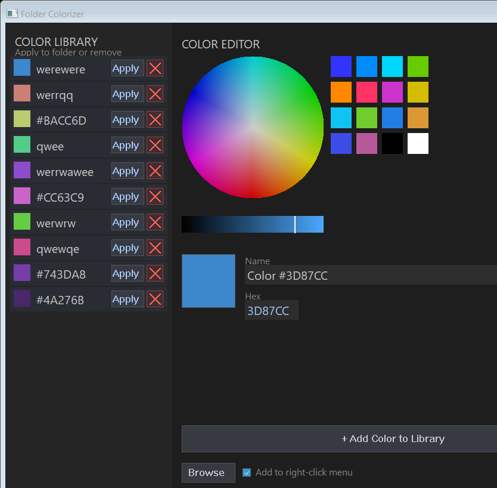

# Folder Colorizer (Rust)

A Windows app to customize folder colors via `desktop.ini` icon customization. Rust port of the original C++ version, using `windows-rs` and GDI+/Win32 APIs.



## Features

- **Color wheel** — pick any color visually
- **16 editable preset colors** — right-click to replace with current color
- **Color library** — save named colors, apply to any folder, remove with ✕ button
- **Folder icon customization** — applies a colored folder `.ico` via `desktop.ini`
- **Context menu integration** — right-click any folder in Explorer for quick color access
- **DPI-aware** — scales properly on high-DPI displays

## Usage

1. Pick a color from the wheel or presets (right side)
2. Optionally type a name and click **+ Add Color to Library**
3. Click **Browse** to select a folder
4. Click **Apply** on a library card or the main **Apply** button
5. The folder gets a colored icon visible in Explorer
6. **Reset** reverts to the original folder appearance

## Build

```powershell
cargo build --release
```

Requires Rust and the `windows` + `image` crates (fetched automatically).

## How it works

The app writes a `desktop.ini` file into the target folder pointing to a generated `.ico` file in `%LOCALAPPDATA%\FolderColorizerRust\`. Windows reads `desktop.ini` to display custom folder icons.

The context menu registers under `HKCU\Software\Classes\Directory\shell\FolderColorizerRust` for per-user install (no admin needed).
